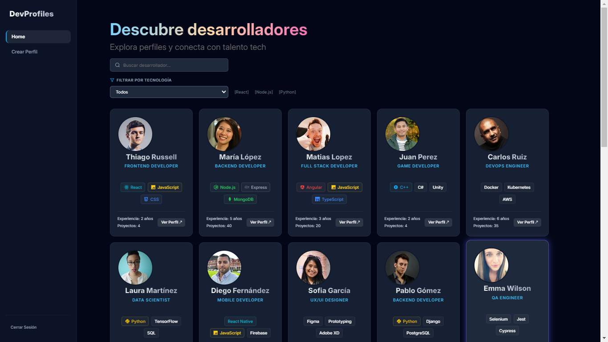
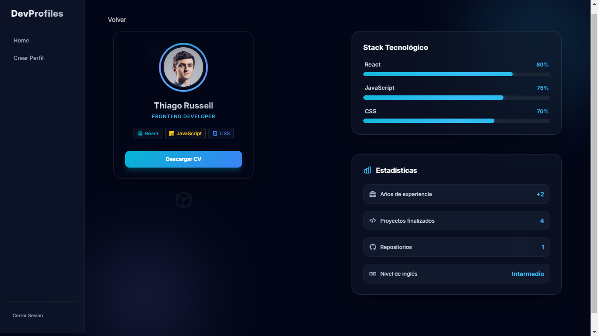
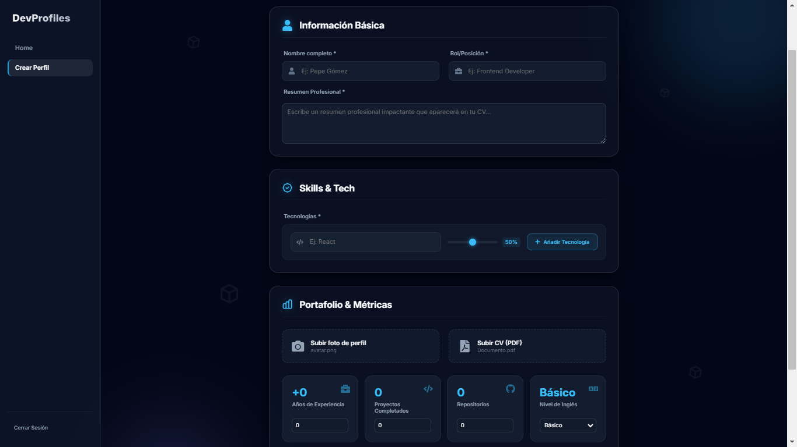
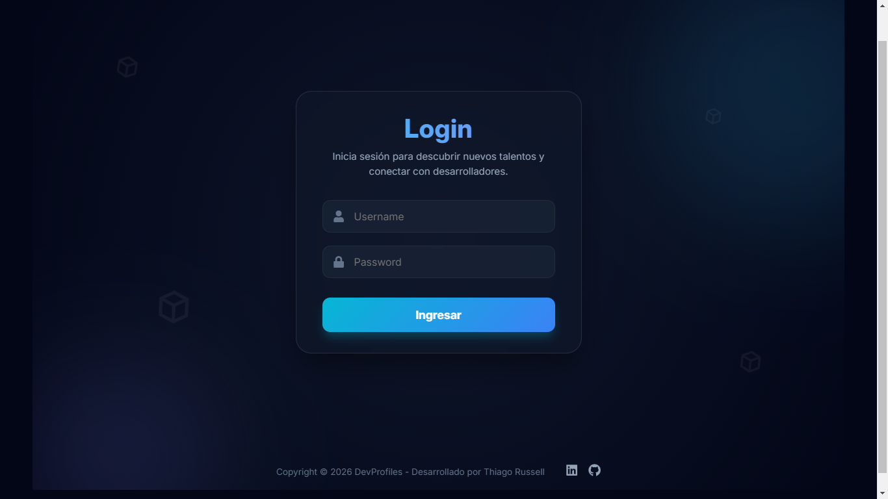

# 🚀 DevProfiles 
## Demo en vivo
https://dev-profiles-gamma.vercel.app/


[](https://reactjs.org/)
[](https://vitejs.dev/)
[](https://www.framer.com/motion/)
[](https://opensource.org/licenses/MIT)

**Objetivo** es una plataforma moderna y sofisticada diseñada para que desarrolladores muestren su talento con una estética premium. Combina un diseño visual impactante con funcionalidades prácticas como la generación automática de CVs profesionales en PDF.
---

## ✨ Características Principales

### 🎨 Experiencia Visual Premium (Glassmorphism)
- **Interfaz Futurista**: Diseño basado en *glassmorphism* con desenfoques en tiempo real y capas translúcidas.
- **Efectos Neon**: Barras de progreso y elementos interactivos con brillos neon dinámicos.
- **Animaciones Fluidas**: Integración profunda con **Framer Motion** para transiciones suaves y estados de carga elegantes.
- **Modo Oscuro Profundo**: Paleta de colores curada para reducir la fatiga visual y resaltar el contenido técnico.

### 📄 Generación de CVs Profesionales
- **Exportación a PDF**: Script automatizado utilizando `PDFKit` para generar currículums con diseño corporativo.
- **Sincronización de Datos**: Los CVs se generan directamente desde los perfiles de los desarrolladores, incluyendo métricas y habilidades.

### 🛠️ Gestión de Perfiles
- **Dashboard Dinámico**: Visualización completa de métricas (años de experiencia, proyectos, repositorios).
- **Búsqueda y Filtrado**: Localización rápida de talentos por tecnología o rol profesional.
- **Formularios Validados**: Sistema robusto de creación de perfiles con validaciones en tiempo real.

---

## 🛠️ Stack Tecnológico

*   **Frontend Core**: React 19 (Hooks & Context API)
*   **Enrutamiento**: React Router 7
*   **Animaciones**: Framer Motion
*   **Estilos**: Vanilla CSS con variables avanzadas y efectos de cristal
*   **Backend (Simulado)**: Datos estáticos con persistencia en el estado global
*   **Herramientas de Build**: Vite
*   **Generación de Documentos**: PDFKit (Node.js)

---

## 📂 Estructura del Proyecto

```text
src/
 ├── components/    # Componentes reutilizables (Navbar, Sidebar, Cards)
 ├── context/       # DeveloperContext para manejo de estado global
 ├── data/          # Mock data y base de datos de desarrolladores
 ├── scripts/       # Scripts de utilidad (Generación de CVs)
 ├── layouts/       # Estructuras de página envolventes
 └── pages/         # Vistas principales (Home, Profile, CreateProfile, Login)
```

## 📸 Preview






*Explora perfiles y conecta con talento tech*


---

## 🚀 Instalación y Uso

### Requisitos previos
- Node.js (v18 o superior)
- npm o yarn

### Pasos para ejecución local

1.  **Clonar el repositorio:**
    ```bash
    git clone https://github.com/thiagocr-dev/DevProfile.git
    cd devprofiles
    ```

2.  **Instalar dependencias:**
    ```bash
    npm install
    ```

3.  **Iniciar el servidor de desarrollo:**
    ```bash
    npm run dev
    ```

4.  **Generar los CVs (Opcional):**
    ```bash
    npm run generate-cvs
    ```

---

## 🔐 Credenciales de Acceso

Para probar las funcionalidades de edición y creación, utiliza las siguientes credenciales:

| Usuario | Contraseña |
| :--- | :--- |
| `admin` | `1234` |

---

## 👨‍💻 Autor

**Thiago Colombo Russell**
-   LinkedIn: [thiago-russell](https://linkedin.com/in/thiago-russell)
-   GitHub: [thiagocr-dev](https://github.com/thiagocr-dev)

---

Desarrollado con ❤️ para la comunidad tech.
